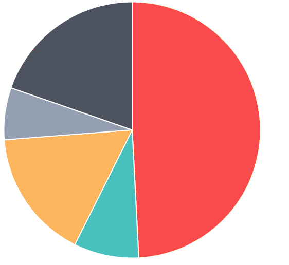

[See an example on heroku](http://chartgemdemo.herokuapp.com) ([Example Source Code](http://github.com/ytbryan/chartdemo))

Chart ships with the following awesome charts:  

* [ChartJS](https://github.com/nnnick/Chart.js/) (1.1.1 & 2.0.1)
* [NVD3](https://github.com/novus/nvd3) (1.8.2)
* [Google Chart](https://developers.google.com/chart/)
* [Highchart](http://www.highcharts.com) (4.2.4)

# Chart

## The motivation for making `chart`

I was reading up on rails engine and decided to test out my new knowledge by making a gem. As my previous project involves making multiple charts, I understand the pain of having duplicate data structure and functions in javascript and ruby just for the different charts.

Chart is my solution to quickly add Javascript/HTML chart into rails. You can write coffeescript/javascript to further interact with the rendered chart. Chart is inspired by another awesome gem `chartkick`

The limitation of chart is  that it generates in-line javascript and it does not aim to be a 100% wrapper for all chart.

Chart works with Sprockets and your asset pipeline.

Several flavours to choose from.

ChartJS (MIT License)
* Bar Chart `<%= bar :id_of_your_chart, size, data %>`
* Line Chart `<%= line :id, size, data %>`
* Pie Chart `<%= pie :id, size, data %>`
* Radar Chart `<%= radar :id, size, data %>`

NVD3 (MIT License)
* Box Plot `<%= boxplot :id, size, data %>`
* Discrete Bar `<%= discrete_bar :id, size, data %>`
* Horizontal Grouped Bar `<%= horizontal_grouped_bar :id, size, data %>`

Google Chart (Open Source)
* Bar Chart `<%= gBar :id, size, data %>`
* Line Chart `<%= gLine :id, size, data %>`
* Pie Chart `<%= gPie :id, size, data %>`

Highchart (Free for Personal usage but paid for Commercial)
* Bar Chart `<%= hBar %>`
* Line Chart `<%= hLine %>`
* Pie Chart `<%= hPie %>`
* Area Chart `<%= hArea %>`


## Installation

Add this line to your application's Gemfile:

```ruby
gem 'chart'
```

At Application.js, write `//= require chart` after turbolinks. Only require the chart if you need them.

```
//= require turbolinks
//= require chart
//= require chart2 (not compatible with chart 1.1.1)
//= require nvd3
//= require google
//= require highcharts
```

At Application.css, write `*= require nvd3`

```
*= require_tree .
*= require nvd3
```

## Example Usage



At your View
```
<%= pie :pie_chart, @pieSize, @pieData%>
```

At your Controller
```
@pieSize = {
    :height => 500,
    :width => 500
  }

  @pieData = [
        {
          value: 300,
          color:"#F7464A",
          highlight: "#FF5A5E",
          label: "Red"
        },
        {
          value: 50,
          color: "#46BFBD",
          highlight: "#5AD3D1",
          label: "Green"
        },
        {
          value: 100,
          color: "#FDB45C",
          highlight: "#FFC870",
          label: "Yellow"
        },
        {
          value: 40,
          color: "#949FB1",
          highlight: "#A8B3C5",
          label: "Grey"
        },
        {
          value: 120,
          color: "#4D5360",
          highlight: "#616774",
          label: "Dark Grey"
        }

      ].to_json
```

## Development

After checking out the repo, run `bin/setup` to install dependencies. Then, run `rake false` to run the tests. You can also run `bin/console` for an interactive prompt that will allow you to experiment.

To install this gem onto your local machine, run `bundle exec rake install`. To release a new version, update the version number in `version.rb`, and then run `bundle exec rake release`, which will create a git tag for the version, push git commits and tags, and push the `.gem` file to [rubygems.org](https://rubygems.org).

## Contributing

Bug reports and pull requests are welcome on GitHub at https://github.com/ytbryan/chart. This project is intended to be a safe, welcoming space for collaboration, and contributors are expected to adhere to the [Contributor Covenant](contributor-covenant.org) code of conduct.


## License

The gem is available as open source under the terms of the [MIT License](http://opensource.org/licenses/MIT).
